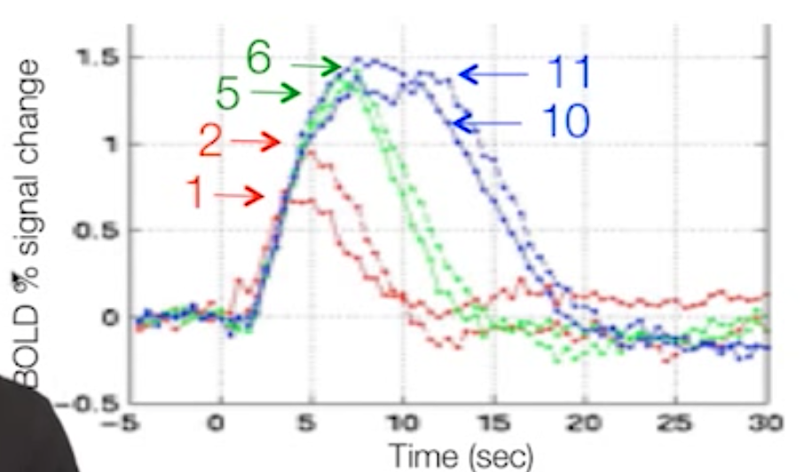

# Video

<iframe width="560" height="315" src="https://www.youtube.com/embed/jG2WQpgpnMs" frameborder="0" allow="accelerometer; autoplay; encrypted-media; gyroscope; picture-in-picture" allowfullscreen></iframe>

# Questions

## HRF

Q. Does the peak at 5 second indicate the time of the highest neural activity? If so, how? If not, why not?

A. TODO

Q. Suppose we choose a TR of 500ms. Roughly at which frame (e.g., 500th, 1000th, 1500th ...etc) may we observe the peak response?

A. TODO

## Flashing Checkerboard

This graph is used to illustrate multiple issues related to nonlinearity. See if you can identify specific patterns or features in the graph that illustrate the said issues.

Q. Where in the graph can we see that there is no linearity if two stimuli are closer that 5 seconds?

A. TODO

Q. Where in the graph can we there is non-linearity if two stimuli are more than 5 seconds apart?

A. TODO

Q. Where in the graph can we see the effect of saturation?

A. TODO

